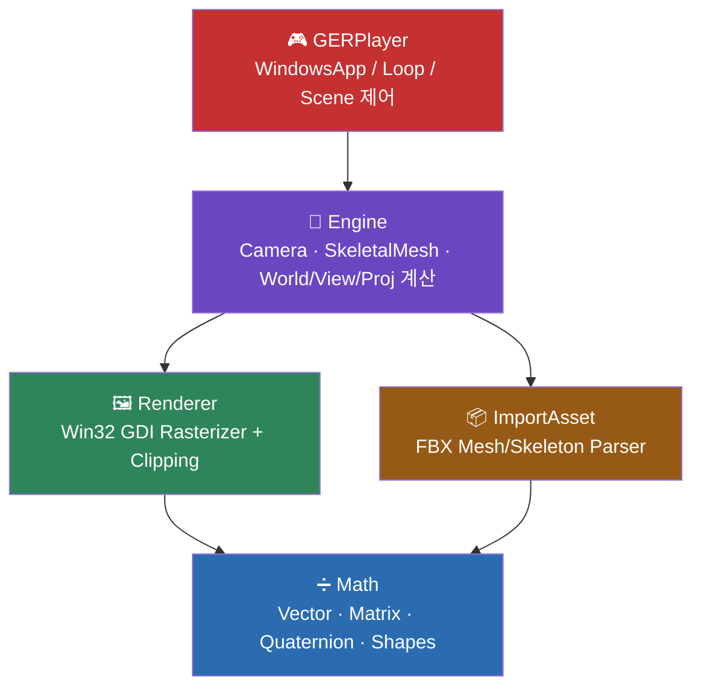

# 🎮 Rendering Engine Project

### GDI 기반 Software Rasterizer로 밑바닥부터 구현한 3D 스켈레탈 애니메이션 엔진

<p align="left">
  
  
  
  
  
</p>


그래픽스 API를 전혀 사용하지 않고, **Win32 GDI 위에서 좌표 변환 · 클리핑 · 래스터라이즈 · 스키닝까지 전 파이프라인을 CPU 코드로 직접 구현**한 렌더링 엔진입니다.

"이득우의 게임수학" 도서를 기반으로 시작해, FBX SDK 연동과 모듈 분리 설계로 확장했습니다.

> 왜 소프트웨어 렌더러인가? — GPU 파이프라인의 좌표 변환, 클리핑, 래스터라이즈, 스키닝 연산을 **한 줄 한 줄 직접 구현하며 그래픽스 파이프라인의 본질을 검증**하기 위한 프로젝트입니다.


<br />

## ✨ Key Features

| | |
|---|---|
|  **No Graphics API** | D3D/OpenGL 없이 Win32 GDI 프레임버퍼만으로 3D 파이프라인 전체를 CPU에서 구현 |
|  **Skeletal Animation** | Bone Hierarchy + Skinning Animation, FBX SDK로 애셋 파싱 |
|  **3D Clipping** | Sutherland–Hodgman 알고리즘 기반 View Frustum 삼각형 클리핑 |
|  **Custom Math Library** | Vector / Matrix / Quaternion / Rotator 등 자체 구현 수학 모듈 |
|  **Profiled & Optimized** | Bone 조회 O(1)화 + Inverse 행렬 Precompute로 **약 69% 성능 향상** |
|  **Modular Architecture** | Math / ImportAsset / Engine / Renderer / Player 5개 모듈로 관심사 분리 |

<br />

## 🏗️ Architecture

의존성은 위(Application)에서 아래(Math)로만 흐르는 단방향 레이어 구조입니다.



| 모듈 | 핵심 책임 | 주요 구성 요소 |
|---|---|---|
| **1️⃣ Engine** | Skeletal 계층/Weight 행렬 계산, SRT → World/Local 행렬, Camera View/Projection 계산 | `CameraObject`, `SkeletalMeshObject` |
| **2️⃣ Math** | 위치·회전·크기·형태를 표현하는 엔진 최하단 기초 라이브러리 | `Vector(2/3/4)`, `Matrix(2x2/3x3/4x4)`, `Quaternion`, `Rotator`, `Box/Sphere/Plane/Frustum` |
| **3️⃣ Renderer** | Win32 GDI 프레임버퍼 구축, 클리핑·투영을 CPU 레벨에서 처리 | Rasterizer, Sutherland–Hodgman Clipper |
| **4️⃣ ImportAsset** | FBX Node 트리 순회로 Mesh(Vertex/Index/UV) + Bone 계층/Transform 파싱 | FBX Importer |
| **5️⃣ GERPlayer** | 프로세스/창 초기화, 엔진 생명주기(Loop), Scene 관리 | WinMain, EngineLoop |

<br />

## ⚡ Performance

Bone 조회 방식과 Skinning 행렬 계산을 최적화하여 **동일 씬 기준 약 69% FPS 향상**을 확인했습니다.

| Version |FPS |
|---|---:|
| Before Optimization | `0.36` |
| After Optimization  | `0.61` |

**🔧 최적화 1 — Bone 조회 O(1)화**

로드 시점에 Bone 이름 → `uint8_t` 인덱스 테이블을 미리 구축해, 매 스키닝 루프마다 발생하던 `unordered_map` 해시 조회를 배열 직접 접근으로 치환했습니다.

```cpp
// Before: 스키닝 루프마다 문자열 비교 + 해시 조회
std::string boneName = w.Bones[wi];
if (skm.HasBone(boneName)) { /* ... */ }

// After: 인덱스 배열 직접 접근
uint8_t boneIdx = w.BoneIndices[wi];
```
→ 문자열 복사 제거, 해시 탐색 제거, 런타임 검증 비용 제거

**🔧 최적화 2 — Inverse BindPose Precompute**

정점마다 반복 계산되던 `bindPoseTransform.Inverse()`를 로드 시점 1회 계산으로 옮기고, 런타임에는 미리 합성된 Skin Matrix만 곱하도록 변경했습니다.

```cpp
// Before: 정점마다 반복되는 Inverse 연산
boneTransform.GetMatrix() * bindPoseTransform.Inverse().GetMatrix() * position

// After: Precompute된 Skin Matrix만 곱함
skinMatrices[boneIdx] * position
```
→ 정점당 Inverse 연산 제거, Bone 조회 제거, 스키닝 루프 단순화

<details>
<summary>📏 FPS 측정 방식 보기</summary>

<br />

`QueryPerformanceCounter` 계열의 Windows High Resolution Performance Counter로 프레임 시간을 측정해 FPS를 계산합니다.

```cpp
// 1. 초기화 시 1ms당 CPU 사이클 수 계산
_CyclesPerMilliSeconds = WindowsUtil::GetCyclesPerMilliSeconds();

// 2. 프레임 시작 타임스탬프 기록
_FrameTimeStamp = _PerformanceMeasureFunc();
if (_FrameCount == 0) _StartTimeStamp = _FrameTimeStamp;

// 3. 프레임/누적 경과 사이클 → ms → FPS 환산
INT64 currentTimeStamp = _PerformanceMeasureFunc();
INT64 frameCycles   = currentTimeStamp - _FrameTimeStamp;
INT64 elapsedCycles = currentTimeStamp - _StartTimeStamp;

_FrameTime   = frameCycles / _CyclesPerMilliSeconds;
_ElapsedTime = elapsedCycles / _CyclesPerMilliSeconds;

_FrameFPS    = 1000.f / _FrameTime;              // 순간 FPS
_AverageFPS  = 1000.f / _ElapsedTime * _FrameCount; // 누적 평균 FPS
```

</details>

<br />

## 🧩 Core Implementation

**Perspective View 행렬 — Camera 공간에서 Clip 공간으로 투영**

뷰 축(viewX/Y/Z)과 FOV/AspectRatio 기반 투영 계수를 한 번에 합성해 World → Clip Space 변환 행렬을 생성합니다.

```cpp
FORCEINLINE Matrix4x4 CameraObject::GetPerspectiveViewMatrix() const
{
    // 뷰 행렬 관련 요소
    Vector3 viewX, viewY, viewZ;
    GetViewAxes(viewX, viewY, viewZ);
    Vector3 pos = _Transform.GetWorldPosition();
    float zPos = viewZ.Dot(pos);

    // 투영 행렬 관련 요소
    float invA = 1.f / _ViewportSize.AspectRatio();
    float d = 1.f / tanf(Math::Deg2Rad(_FOV) * 0.5f);
    float dx = invA * d;
    float invNF = 1.f / (_NearZ - _FarZ);
    float k = (_FarZ + _NearZ) * invNF;
    float l = 2.f * _FarZ * _NearZ * invNF;

    return Matrix4x4(
        Vector4(dx * viewX.X, d * viewY.X, k * viewZ.X, -viewZ.X),
        Vector4(dx * viewX.Y, d * viewY.Y, k * viewZ.Y, -viewZ.Y),
        Vector4(dx * viewX.Z, d * viewY.Z, k * viewZ.Z, -viewZ.Z),
        Vector4(-dx * viewX.Dot(pos), -d * viewY.Dot(pos), -k * zPos + l, zPos)
    );
}
```

**그 외 파이프라인 구현 포인트**

- **Sutherland–Hodgman Clipping** — View Frustum 6평면 기준 3D 삼각형을 순차적으로 잘라내는 CPU 클리핑
- **Software Rasterizer** — Win32 GDI 프레임버퍼에 직접 픽셀을 채워 넣는 자체 Rasterizer
- **FBX Skeleton Import** — FBX Node 트리를 순회하며 Bone 계층과 시간별 Transform을 파싱해 애니메이션 데이터로 변환

<br />

## 📁 Project Structure

```
Source/
├── Runtime/
│   ├── Math/          # Vector, Matrix, Quaternion, Geometric Shapes
│   ├── ImportAsset/    # FBX Mesh/Skeleton Parser
│   ├── Engine/         # Camera, SkeletalMesh, Scene Object
│   └── Renderer/       # Win32 GDI Rasterizer, Clipping
└── Player/
    └── GERPlayer/      # WindowsApp Entry, Engine Loop
```

<br />

## 🚀 Build

| 항목 | 버전 |
|---|---|
| FBX SDK | [2020.3.7 (VS2019)](https://aps.autodesk.com/developer/overview/fbx-sdk) |
| Platform | Windows / Win32 GDI |
| Language | C++17 |

